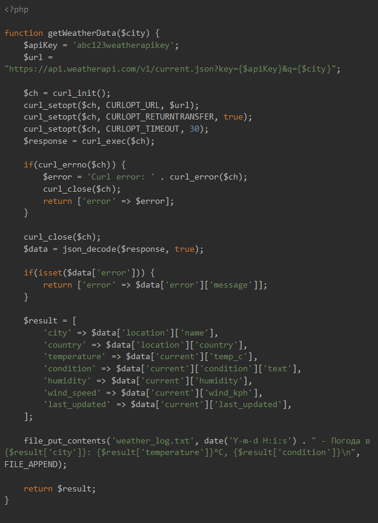
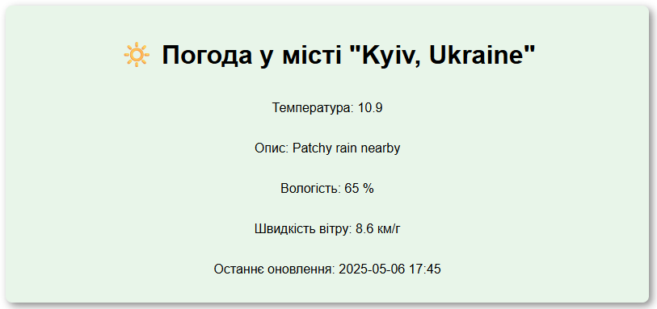

## Laravel application that retrieves data from an external weather API provider

### Description
This project is an object-oriented refactoring of the procedural function `getWeatherData($city)`, following OOP and SOLID principles.



A `Providers` layer was introduced to encapsulate the HTTP logic of external weather API providers.
This allows to easily swap API providers without affecting the core business logic, just implement a new provider class.

The business logic itself is located in the `WeatherService`.

To access the functionality, use the `/weather?city={name}` endpoint.

There are a couple of tests located in `./tests/Unit/WeatherServiceTest.php`.

### Installation

```
git clone
```

```
composer install
```

```
cp .env.example .env
```
You should get the API key from your account and paste it as the value of the
`WEATHER_API_KEY` parameter.

The weather feature is now accessible via your browser by the `/weather?city={name}` endpoint.

### Example of a weather data



### Example of error display


